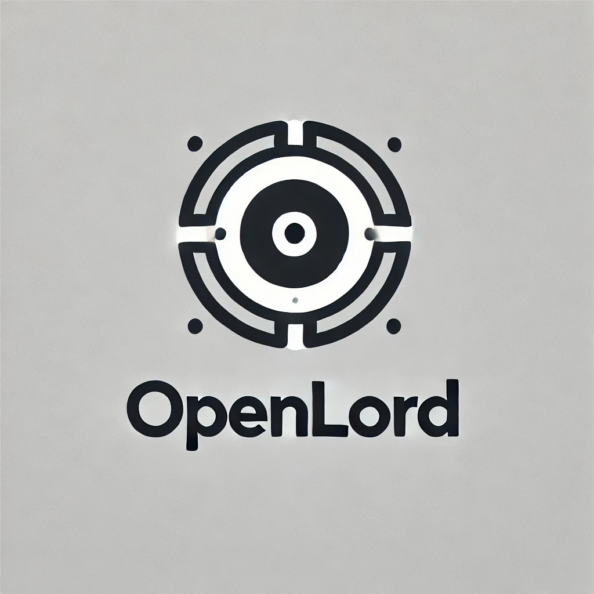

# OpenLord



OpenLord is a simple open-source chatbot built with cutting-edge AI models and technologies. It leverages the power of the Vercel AI SDK to provide an intelligent and responsive chat experience.

## Technologies Used

- [Vercel AI SDK](https://sdk.vercel.ai/docs/)
- [Next.js](https://nextjs.org/)
- [shadcn/ui](https://ui.shadcn.com/)

## Getting Started

### Prerequisites

- Node.js
- npm

### Installation

1. Clone the repository:

    ```bash
    git clone https://github.com/zaidmukaddam/openlord.git
    cd openlord
    ```

2. Install the dependencies:

    ```bash
    npm install
    ```

3. Create a `.env.local` file in the project root and add your API keys:

    ```env
    cp .env.example .env.local
    ```

### Running the Development Server

To start the development server, run:

```bash
npm run dev
```

Open [http://localhost:3000](http://localhost:3000) with your browser to see the result.

## Configuration

To change the models, you can modify the `model` configurations in the `app/api/chat/route.ts`, `@lib/types.ts` and `@components/chat/SettingsPanel.tsx` files.

## Deployment

The easiest way to deploy your Next.js app is to use the [Vercel Platform](https://vercel.com/new?utm_medium=default-template&filter=next.js&utm_source=create-next-app&utm_campaign=create-next-app-readme).

Check out [Next.js deployment documentation](https://nextjs.org/docs/deployment) for more details.

Remember to add the environment variables as specified in your [`.env.local`](.env.local) file to your deployment settings.

## License

This project is licensed under the MIT License. See the [`LICENSE`](LICENSE") file for details.

## Contributing

Contributions are welcome! Please open an issue or submit a pull request.

## Acknowledgements

- Inspired by the [Vercel AI SDK](https://sdk.vercel.ai/docs).

## Contact

For any inquiries, please contact [Zaid Mukaddam](zaidmukaddam.com).
